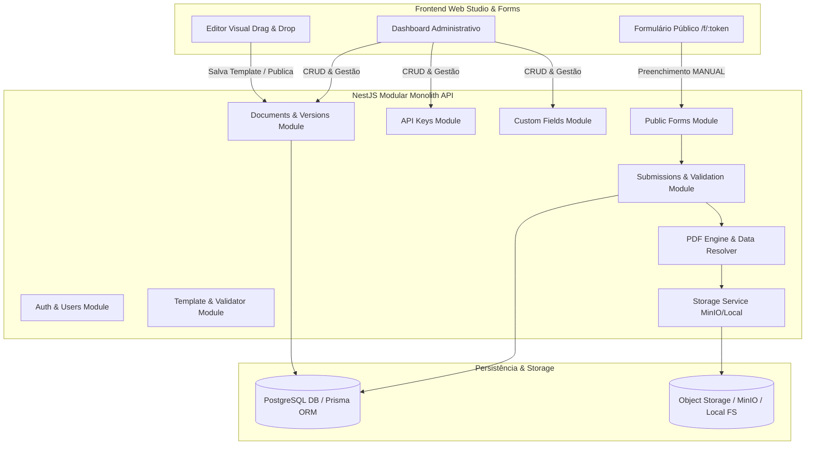

# Plano de Implementação — Plataforma de Documentos Dinâmicos (Dynamic Documents)

Implementação completa do sistema de Documentos Dinâmicos baseado no **PRD** e na **Especificação Técnica do Backend MVP**, estruturado como um monólito modular robusto em **NestJS + TypeScript + Prisma + PostgreSQL + PDF Engine**, acompanhado pelo **Frontend Web Studio & Public Form Engine**.

---

## 1. Visão Geral da Arquitetura

O sistema implementa o princípio central de **Document Engine**:
$$\text{Template JSON} + \text{Dados de Entrada} + \text{Regras de Validação/Estilo} \longrightarrow \text{Documento PDF Gerado}$$

O backend é agnóstico quanto à origem dos dados de sistemas externos (ERP, CRM, hospitalar), conhecendo apenas a chave (`key`), o tipo (`type`), validações, formatações e modo de entrada (`MANUAL` vs `INTEGRATION`).



---

## 2. Componentes e Fases de Implementação

### Fase 1: Fundação do Backend (NestJS + Prisma + Config + Swagger + Filtros Globais)
- **Estrutura base do projeto NestJS** com TypeScript, `package.json`, `tsconfig.json`, `nest-cli.json`.
- **ConfigModule** tipado validando variáveis de ambiente via Joi/class-validator (`DATABASE_URL`, `JWT_SECRET`, `STORAGE_*`, `PORT`).
- **Prisma Service & Schema PostgreSQL**:
  - Modelos: `User`, `Document`, `DocumentVersion`, `DocumentPage`, `CustomFieldDefinition`, `Submission`, `Asset`, `ApiKey`.
  - Suporte a JSON/JSONB para `template` e `data`.
  - Índices compostos e de unicidade conforme especificação (seção 53).
- **Global Pipes & Filters**:
  - `ValidationPipe` com `whitelist: true`, `forbidNonWhitelisted: true`, `transform: true`.
  - `GlobalExceptionFilter` padronizando respostas HTTP de erro (`statusCode`, `code`, `message`, `errors`, `timestamp`, `path`).
  - Structured `LoggerService`.
- **Swagger / OpenAPI**: documentação completa em `/api/docs` com suporte a Bearer JWT e Bearer API Key.
- **Docker**: `Dockerfile` multi-stage e `docker-compose.yml` configurando PostgreSQL, MinIO e a API.

### Fase 2: Autenticação & Usuários
- Modelo `User` com roles (`ADMIN`), password hash com `bcrypt`.
- `AuthModule`: endpoints `POST /api/v1/auth/login` e `GET /api/v1/auth/me`.
- `JwtStrategy`, `JwtAuthGuard` e decorator `@CurrentUser()`.
- Seed automático (`prisma/seed.ts`) com admin padrão (`admin@dynamicdocs.com` / `Admin123!`).

### Fase 3: Documentos (Documents Module)
- Entidade `Document` com status (`DRAFT`, `PUBLISHED`, `ARCHIVED`), geração criptográfica de `publicToken` aleatório e imprevisível.
- CRUD em `POST /api/v1/documents`, `GET /api/v1/documents` (com paginação, filtros e busca), `GET /api/v1/documents/:id`, `PUT /api/v1/documents/:id`, `DELETE /api/v1/documents/:id` (soft-delete).

### Fase 4: Versões do Documento (DocumentVersions Module) & Imutabilidade
- Entidade `DocumentVersion` vinculada ao documento com `versionNumber` incremental.
- Endpoints:
  - `GET /api/v1/documents/:id/versions`
  - `POST /api/v1/documents/:id/versions` (criação vazia ou clonagem via `sourceVersionId`)
  - `GET /api/v1/documents/:id/versions/:versionId`
  - `PUT /api/v1/documents/:id/versions/:versionId` (permitido apenas em status `DRAFT`, retorna **409 CONFLICT** se já publicada)
  - `POST /api/v1/documents/:id/versions/:versionId/publish`
- **Regra de Imutabilidade e Transação de Publicação**:
  - Valida o template completo antes de publicar.
  - Executa transação do Prisma: arquiva versão publicada anterior (`ARCHIVED`), marca a nova versão como `PUBLISHED`, atualiza `document.publishedVersionId` e `document.status = PUBLISHED`.

### Fase 5: Template Engine & Validação Estrutural (TemplateValidatorService)
- Tipos TypeScript estritos para `DocumentTemplate`, `PageConfiguration`, `DocumentTemplatePage`, `DocumentTemplateField`, `FieldStyle`, `FieldValidation`, etc.
- `TemplateValidatorService`:
  - Validação de tamanhos (`A4`, `A5`, `LETTER`, `LEGAL`) e orientações (`PORTRAIT`, `LANDSCAPE`).
  - Validação de campos suportados (`TEXT`, `NUMBER`, `DATE`, `IMAGE`, `FILE`) e modos (`MANUAL`, `INTEGRATION`).
  - Verificação de unicidade de `field.key`.
  - Verificação de limites de coordenadas ($x, y, width, height$) e páginas existentes.
  - Validação de regras de estilo, formatação e máscaras.

### Fase 6: Storage Service & Assets
- Interface `StorageService` (`upload`, `delete`, `getSignedUrl`, `getObject`, `getStream`).
- Implementações:
  - `LocalStorageService` (com armazenamento em disco local e streaming seguro para desenvolvimento sem dependência externa).
  - `S3StorageService` (compatível com MinIO e AWS S3 com credenciais dinâmicas).
- Entidade `Asset` no banco de dados.
- Validação rigorosa de arquivos (MIME types permitidos, tamanho máximo) e proteção contra SSRF no download de URLs externas.

### Fase 7: PDF Rendering Engine & Data Resolver
- `DataResolverService`: resolução segura e sanitizada de valores de campo sem uso de `eval` ou código arbitrário.
- `MaskService`: formatação dinâmica para `CPF`, `CNPJ`, `CEP`, `PHONE` e números/datas na renderização.
- `PdfDocumentRenderer` (usando `pdf-lib` + `fontkit`):
  - Renderização de páginas com dimensões em pontos (`pt`).
  - Suporte a PDF ou imagem de background importada.
  - Renderização de campos com posicionamento milimétrico, quebra de linha, tamanhos, cores RGB/Hex, negrito, itálico, alinhamento (`LEFT`, `CENTER`, `RIGHT`) e vertical (`TOP`, `CENTER`, `BOTTOM`).
  - Inclusão de imagens remotas/locais sanitizadas.

### Fase 8: Submissions & Validação de Preenchimento
- `SubmissionValidationService`:
  - Validação de campos `TEXT` (`required`, `minLength`, `maxLength`, `regex`).
  - Validação de campos `NUMBER` (`required`, `min`, `max`, `decimalPlaces`).
  - Validação de campos `DATE` (`required`, `minDate`, `maxDate`).
  - Validação de campos `IMAGE`/`FILE` (URLs seguras, extensões/MIMEs).
- `SubmissionService`:
  - Persistência dos dados dinâmicos em JSONB.
  - Vinculação obrigatória e perene com `documentVersionId` (garantindo que execuções históricas usem sempre a versão original).
  - Renderização do PDF correspondente, salvamento do Asset gerado e retorno de `{ submissionId, documentId, version, status, documentUrl }`.
  - Endpoints: `GET /api/v1/submissions`, `GET /api/v1/submissions/:id`, `GET /api/v1/submissions/:id/document` (streaming do PDF).

### Fase 9: Formulários Públicos (Public Forms Module)
- Endpoint `GET /api/v1/public/forms/:token`:
  - Localiza o documento pelo `publicToken`.
  - Obtém a versão publicada atual.
  - Retorna metadados e **exclusivamente os campos com `inputMode: MANUAL`** (ocultando campos `INTEGRATION`).
- Endpoint `POST /api/v1/public/forms/:token/submissions`:
  - Valida os dados enviados.
  - **Rejeita estritamente qualquer tentativa de preencher campos `INTEGRATION` via formulário público**.
  - Cria a Submission, renderiza o PDF e retorna o resultado.

### Fase 10: API Keys & Integrações Externas
- Entidade `ApiKey` com armazenamento exclusivo do hash SHA-256 (`keyHash`), data de expiração, revogação e tracking `lastUsedAt`.
- Endpoints de gestão: `GET /api/v1/api-keys`, `POST /api/v1/api-keys` (exibe a chave em texto claro uma única vez), `DELETE /api/v1/api-keys/:id`.
- `ApiKeyGuard` validando o cabeçalho `Authorization: Bearer <API_KEY>`.
- Endpoints protegidos para integração:
  - `GET /api/v1/documents/:id/schema`: retorna o contrato JSON de preenchimento (todos os campos com tipos e modos).
  - `POST /api/v1/documents/:id/submissions`: recebe os dados completos (incluindo campos `INTEGRATION` e `MANUAL`), valida e gera o documento.
  - `POST /api/v1/documents/:id/validate`: valida payload sem gerar a submission.

### Fase 11: Campos Personalizados (Custom Fields Module)
- Entidade `CustomFieldDefinition` para catálogo de termos de negócio (`nomePaciente`, `numeroContrato`, etc.).
- CRUD: `GET /api/v1/custom-fields`, `POST /api/v1/custom-fields`, `GET /api/v1/custom-fields/:id`, `PUT /api/v1/custom-fields/:id`, `DELETE /api/v1/custom-fields/:id`.
- Proteção na exclusão: impede remoção de Custom Field caso esteja em uso por alguma versão publicada.

### Fase 12: Importação de PDF & DOCX
- Endpoints `POST /api/v1/documents/:id/import/pdf` e `POST /api/v1/documents/:id/import/docx`.
- Processamento:
  - Validação e upload do arquivo como Asset.
  - Extração do número de páginas e dimensões.
  - Criação de versão com páginas de background correspondentes para sobreposição de campos dinâmicos no Builder.

---

## 3. Frontend Web Studio & Public Form Experience

Uma aplicação web completa, moderna e responsiva (Vanilla CSS / TypeScript / Vite ou Web App integrado):
1. **Painel Administrativo & Dashboard**:
   - Gestão de Documentos (criar, clonar, excluir, listar com paginação e busca).
   - Gerenciamento de Versões e Histórico.
   - Catálogo de Custom Fields.
   - Gerenciamento e Emissão de API Keys.
   - Visualizador de Submissions com download/preview imediato de PDFs gerados.
2. **Editor Visual Drag-and-Drop (Builder)**:
   - Canvas interativo com guias de alinhamento, grid, zoom e seleção de formatos (A4, A5, Letter, Legal).
   - Paleta de componentes dinâmicos (Texto, Número, Data, Imagem, Arquivo, Custom Fields).
   - Painel lateral de propriedades (estilo, tipografia, cores, máscaras, validações, input mode).
   - Upload e renderização de background (PDF/DOCX).
   - Botão de publicação com validação instantânea do template.
3. **Página de Formulário Público (`/f/:token`)**:
   - Layout elegante com suporte a máscaras em tempo real (CPF, CNPJ, CEP, Telefone).
   - Validações instantâneas acessíveis e submissão com download do PDF resultante.
4. **API Explorer & Documentação Interativa**:
   - Teste de schema e simulação de submissões de integração via API Key.

---

## 4. Estrutura de Arquivos Proposta

```text
portal-documentos-dinamicos/
├── backend/
│   ├── prisma/
│   │   ├── schema.prisma
│   │   └── seed.ts
│   ├── src/
│   │   ├── main.ts
│   │   ├── app.module.ts
│   │   ├── config/
│   │   ├── common/
│   │   │   ├── filters/
│   │   │   ├── guards/
│   │   │   ├── decorators/
│   │   │   └── pipes/
│   │   ├── auth/
│   │   ├── users/
│   │   ├── documents/
│   │   ├── document-versions/
│   │   ├── templates/
│   │   ├── fields/
│   │   ├── custom-fields/
│   │   ├── storage/
│   │   ├── rendering/
│   │   ├── submissions/
│   │   ├── public-forms/
│   │   ├── api-keys/
│   │   └── import/
│   ├── test/
│   │   ├── unit/
│   │   ├── integration/
│   │   └── e2e/
│   ├── Dockerfile
│   ├── docker-compose.yml
│   ├── tsconfig.json
│   └── package.json
├── frontend/
│   ├── src/
│   │   ├── index.html
│   │   ├── styles/
│   │   ├── components/
│   │   ├── pages/ (Dashboard, Builder, PublicForm, Submissions, ApiKeys, CustomFields)
│   │   └── services/ (apiClient, templateStore, canvasEngine)
│   ├── package.json
│   └── vite.config.ts
└── README.md
```

---

## 5. Plano de Verificação e Testes

### Testes Automatizados
- **Unitários**:
  - `TemplateValidatorService.spec.ts`: validação de templates válidos, detecção de chaves duplicadas, coordenadas inválidas, tipos desconhecidos.
  - `SubmissionValidationService.spec.ts`: validação de regras TEXT, NUMBER, DATE, campos obrigatórios, rejeição de campos `INTEGRATION` no fluxo público.
  - `MaskService.spec.ts`: aplicação de máscaras CPF, CNPJ, CEP, Telefone.
  - `DataResolverService.spec.ts`: resolução segura de campos e prevenção de injeção.
  - `DocumentsService.spec.ts` & `DocumentVersionsService.spec.ts`: imutabilidade, publicação e arquivamento de versões.
- **E2E / Integração**:
  - **Cenário 1 — Documento Vazio**: Criar documento $\rightarrow$ Criar versão $\rightarrow$ Salvar template $\rightarrow$ Publicar $\rightarrow$ Submissão $\rightarrow$ PDF gerado e validado.
  - **Cenário 2 — Documento com Integração**: Criar Custom Field $\rightarrow$ Usar no template com `INTEGRATION` $\rightarrow$ Publicar $\rightarrow$ Enviar dados via API com API Key $\rightarrow$ Validar PDF.
  - **Cenário 3 — Versionamento e Imutabilidade**: Version 1 $\rightarrow$ Publicar $\rightarrow$ Submission A $\rightarrow$ Version 2 $\rightarrow$ Publicar $\rightarrow$ Submission B $\rightarrow$ Garantir que Submission A continua vinculada à Version 1 e re-gerável fielmente.
  - **Cenário 4 — Proteção de Campos Integration Only**: Acesso ao formulário público $\rightarrow$ Confirmação de ausência de campos `INTEGRATION` $\rightarrow$ Tentativa de envio de campo `INTEGRATION` no endpoint público rejeitada com erro 422.

### Verificação Manual e E2E Visual
1. Inicialização do servidor backend NestJS com Swagger ativo em `http://localhost:3000/api/docs`.
2. Execução do frontend Studio em `http://localhost:5173`.
3. Login no painel de administração, criação de um documento e edição no Builder Drag-and-Drop.
4. Publicação da versão e acesso ao formulário público pelo link `/f/{publicToken}`.
5. Preenchimento de dados reais e download do PDF renderizado com conferência visual dos campos e máscaras.
6. Emissão de API Key e execução de chamada HTTP via `POST /api/v1/documents/:id/submissions` verificando a geração da Submission.
